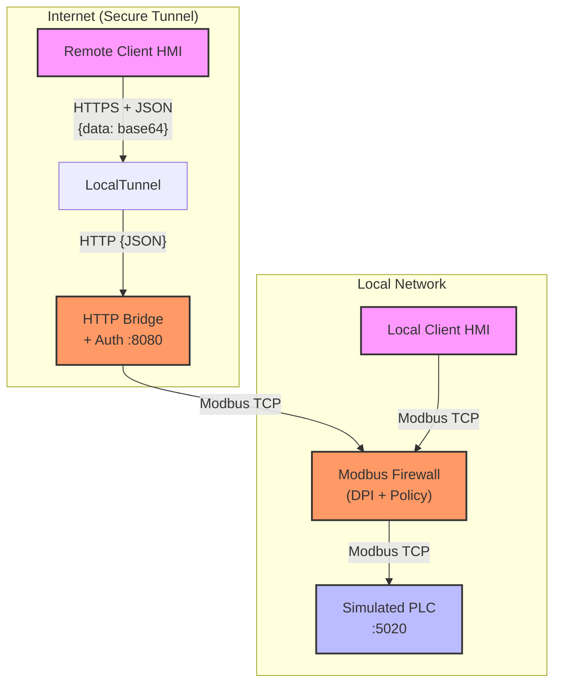

# Modbus Firewall & Remote Access System

A professional, role-based security solution for protecting Modbus TCP communications in Industrial Control Systems (ICS). This project implements a Deep Packet Inspection (DPI) firewall with differentiated local/remote security policies and secure HTTP-bridged remote access.

## 🏗 System Architecture

The system is designed to sit between an HMI/Client and a PLC/Server, acting as a security proxy that inspects every packet.



---

## 🛠 Project Components

The project is organized into a modular structure:

- **`core/`**: The heart of the system.
    - `firewall.py`: The transparent proxy that performs packet interception.
    - `server.py`: A simulated PLC with thermal power plant register mappings.
    - `client.py`: An interactive HMI for reading/writing data.
    - `config.py`: Centralized security policies and network settings.
- **`network/`**: Handles remote connectivity.
    - `http_bridge.py`: An asynchronous HTTP server that wraps Modbus in HTTP for tunnel compatibility.
    - `http_client.py`: A wrapper used by the client to communicate over HTTP.
- **`utils/`**: Shared logic and engines.
    - `dpi_engine.py`: Parses the Modbus TCP ADU and extracts function codes/data.
    - `security.py`: Evaluates packets against the active Security Policy.
    - `logging.py`: Rich console logging and file alerts.

---

## 🔄 How It Works: Step-by-Step Logic

### 1. Connection Initialization
When the system starts, the Firewall establishes a listening socket. It handles two types of entries:
*   **Direct TCP**: Used by local clients on the same network.
*   **HTTP Bridge**: Facilitates remote connections. The bridge converts incoming HTTP POST requests (from the remote client) into local Modbus TCP packets.

### 2. Authentication Flow (Role-Based Access Control)
The system differentiates access based on *where* you are connecting from:

*   **Local Entry**: No password required. Governed by `LocalSecurityPolicy` (typically full read access, restricted write).
*   **Remote Entry**: 
    - **Initial State**: Read-Only by default. Access level is "READ-ONLY".
    - **Admin Elevation**: If the user selects "Admin", they must provide an 8-character password (generated by the firewall at startup).
    - **Retry Logic**: 3 attempts are allowed. Failure forces the user into Read-Only mode.

### 3. Packet Interception (DPI)
Once a client sends a request (e.g., "Read Holding Register 100"):
1.  **DPI Engine**: Extracts the **MBAP Header** and the **PDU**.
2.  **Validation**: Checks if the Length field matches the actual payload.
3.  **Function Code Extraction**: Identifies what the client is trying to do (Read, Write, etc.).

### 4. Policy Enforcement
The `SecurityEngine` checks the extracted info against the configuration:
*   **Whitelist Check**: Is Function Code 0x03 allowed? (Yes).
*   **Blacklist Check**: Is Function Code 0x05 blocked? (Yes - Coil writes are dangerous).
*   **Access Level Check**: Is this a remote non-admin trying to write? (Access Denied).

### 5. Forwarding & Response
If allowed, the Firewall opens a connection to the real PLC, forwards the packet, receives the response, and sends it back to the HMI. If blocked, it drops the packet and logs a security alert.

---

## 🔐 Security Model Summary

| Access Type | Read Access | Write Access | Auth Required |
| :--- | :--- | :--- | :--- |
| **Local Client** | ✅ Full | ✅ Allowed (Registers) | ❌ No |
| **Remote Guest** | ✅ Full | ❌ Blocked | ❌ No |
| **Remote Admin** | ✅ Full | ✅ Allowed (Registers) | ✅ Yes |

---

## 🚀 Setup & Execution

### 1. Requirements
Install the necessary Python packages:
```bash
pip install pyModbusTCP aiohttp requests rich
```
*Note: Ensure `npx` (Node.js) is installed for LocalTunnel.*

### 2. Workflow
To run the full system, open three terminals:

1.  **Start PLC**: `python -m core.server`
2.  **Start Firewall**: `python -m core.firewall`
    - *Look for the generated Admin Password in the console output.*
3.  **Start Client**: 
    - **Local**: `python -m core.client`
    - **Remote**: `python -m core.client --remote <URL_FROM_FIREWALL>`

---

## 📈 Process Simulation
The system is pre-configured with a **Thermal Power Plant** theme, simulating realistic fluctuations in:
- Boiler Temperature & Pressure
- Turbine Speed & Frequency
- Feedwater Flow & Steam Valves

This allows for realistic testing of SCADA/HMI security scenarios.
